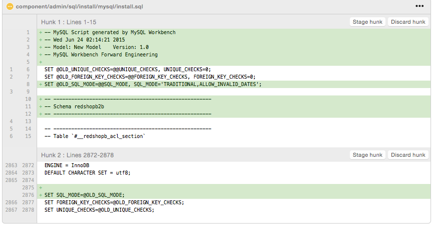

MySQL Workbench file for redSHOP B2B model
======

## Considerations for maintaining the database

1. Keep the model diagrams up to date.     
2. If you are working on a new topic, just add a new diagram and keep the tables in a yellow layer.  The related tables can be out of the layer.     
3. When adding foreign keys to a table, start their names with #__rs_ and always keep short names to avoid problems with older MySQL engines.  Also customize the UPDATE and DELETE actions.      
4. Also keep the same names for the table indexes created for the related FK columns.      
5. Add control fields when relevant.     
6. Always remember to send the model, and when bumping version with schema changes, always send the updated redSHOPB2B.mwb file to match the install.sql file.

## Creating the install.sql file

1. Use the Forward Engineer SQL Create Option under File > Export.     
2. Point to the install.sql file and omit schema qualifiers under the export option set.     
3. Make sure that tables are being exported, show the filter and exclude the Joomla tables that are just used for foreign key references.     
4. Export the file into install.sql and drop the header lines, and also the SET @OLD_SQL_MODE option to avoid problems with some MySQL engines (check the green sections in the image)     
